https://github.com/user-attachments/assets/883ee474-080a-40ce-a049-1f40b8205450

# Beyond Monitoring: Autonomous Agentic AI Kubernetes Intelligence Platform

[](https://opensource.org/licenses/MIT)
[](https://www.python.org/)
[](https://vitejs.dev/)
[](https://react.dev/)
[](https://kubernetes.io/)

Observability platforms have historically focused on **passive data visualization**—requiring humans to stare at dashboards, interpret graphs, set static alerting thresholds, and execute manual recovery runbooks. 

**Beyond Monitoring** represents a paradigm shift. It is an autonomous, agentic SRE (Site Reliability Engineering) platform that transforms raw telemetry into **active diagnostic understanding and self-healing execution**. By combining real-time machine learning (Scikit-Learn Isolation Forest), Natural Language Processing (TF-IDF keyword clustering), directed graph topology (NetworkX), and a highly resilient generative AI SRE Orchestrator (Gemini), the platform automatically discovers anomalies, traces cascading failures, maps dependencies, and triggers targeted self-healing remediations.

---

## 🏗️ Core System Architecture

The following directed graph maps the data collection, ML processing, conversational analysis, and remediation loops across the platform:

```mermaid
graph TD
    subgraph Data Telemetry Layer
        K8s[Kubernetes Pods & Services] -->|Scraped by| Prom[Prometheus Engine]
        K8s -->|Logs streamed| Loki[Grafana Loki]
        Host[Windows/Linux OS Host] -->|Telemetry fallback| psutil[Live Host psutil]
    end

    subgraph Agentic Intelligence Engine
        Collector[SystemMetricsCollector] -->|Standardizes raw data| Connector[PrometheusConnector]
        
        %% Agent 1
        IF[ResourceAnomalyDetector] -->|Queries CPU/Memory| Connector
        IF -->|Trains ML Model| IsolationForest[Isolation Forest Classifier]
        
        %% Agent 3
        DM[DependencyMapper] -->|Builds Directed Topology| NetworkX[NetworkX Directed Graph]
        
        %% Agent 4
        LogAgent[LogIntelligenceAgent] -->|Queries Log Stream| Loki
        LogAgent -->|Runs text processing| TFIDF[TF-IDF NLP Vectorizer]
        
        %% Agent 6
        Streamer[MetricsStreamer] -->|Saves rolling deque window| DequeStore[(Deque Store: 30 ticks)]
    end

    subgraph SRE Orchestrator & Remediation
        %% Agent 2
        Master[MasterOrchestrator SRE] -->|Synthesizes insights| IF
        Master -->|Analyzes keywords| LogAgent
        Master -->|Resilient Fallback Rotation| Gemini[Gemini 2.5 LLM]
        
        %% Agent 5
        Remedy[AutoRemediationAgent] -->|Triggers Healing| K8s
        Remedy -->|Terminates Processes| Host
    end

    subgraph Premium Glassmorphic Frontend
        UI[Vite React Dashboard] -->|REST Polling| Connector
        UI -->|Timeseries charts| Streamer
        UI -->|Cytoscape graph| DM
        UI -->|Direct chat| Master
        UI -->|Trigger remediation button| Remedy
    end

    style K8s fill:#326CE5,stroke:#fff,stroke-width:2px,color:#fff
    style Prom fill:#e6522c,stroke:#fff,stroke-width:2px,color:#fff
    style Gemini fill:#4285F4,stroke:#fff,stroke-width:2px,color:#fff
    style UI fill:#8a2be2,stroke:#fff,stroke-width:2px,color:#fff
```



---

## ⚡ Key Platform Features

1.  **Dual-Mode Telemetry Failover & Instant Socket Probe**: Queries native Kubernetes metrics (via Prometheus and Grafana Loki) when deployed inside a cluster. The platform incorporates a **fast socket probe check (`_probe_prometheus`)** during initialization. If Prometheus is unreachable, it instantly falls back to live host-level system metrics (`psutil`) with zero latency, ensuring zero-config local development.
2.  **Dynamic Machine Learning Baselines**: Employs an online `Isolation Forest` classification model. Rather than relying on rigid, static human-defined thresholds (e.g., "CPU > 80%"), the model dynamically establishes a mathematical cluster baseline and highlights anomalous outliers.
3.  **Cascading NLP Failure Analysis**: Extracts error log streams and runs term frequency-inverse document frequency (`TF-IDF`) vectorization to mathematically cluster and pinpoint dominant error patterns.
4.  **Resilient SRE Chat & Insight Engine with Local AI Fallback**: Features an SRE chat assistant allowing engineers to query the live cluster state, backed by a **resilient API key fallback and dynamic rotation algorithm**. If all LLM keys are exhausted, rate-limited, or not configured, it **automatically falls back to a rules-based local SRE engine**, ensuring 100% uptime offline.
5.  **Interactive Directed Network Mapping with Dynamic Anomaly Highlighting**: Computes high-fidelity topological directed graphs representing ingress vectors, highlighting failing container vertices in real-time. Nodes are mapped using a **high-performance concentric layout** (centering the ingress gateway) and anomalous pods are styled with prominent warning borders and high-contrast red highlights.
6.  **Closed-Loop Auto-Remediation**: Empowers the platform to self-heal. Operators can execute targeted self-healing scripts that either terminate rogue Kubernetes pods (letting replica sets spin up healthy containers) or safely terminate high-CPU host PIDs on local machines.

---

## 🧠 The 6 Intelligent SRE Agents in Detail

### 1. ResourceAnomalyDetector (Isolation Forest Agent)
*   **Module**: `backend/agents/anomaly_detector.py`
*   **Role**: Identifies misbehaving containers or processes.
*   **Implementation**: Instantiates `sklearn.ensemble.IsolationForest` with `contamination=0.1`. It continuously extracts the CPU rate and memory utilization of every active entity, constructs a 2D feature matrix $X$, fits the estimator, and classifies outliers ($DecisionScore < 0$).
*   **Safety Threshold**: Requires a minimum baseline of 3 running processes/pods to prevent false positives during startup or cluster scaling.

### 2. MasterOrchestrator (Resilient Gemini SRE Orchestrator)
*   **Module**: `backend/agents/master_orchestrator.py`
*   **Role**: Consolidates raw data from all agents to generate conversational SRE insights and drive the interactive chat dashboard.
*   **Resilient API Key Fallback & Rotation System**:
    To guarantee high availability and bypass API rate limits or quota boundaries, the Orchestrator implements autonomous configuration fallback loops:
    *   It checks `.env` for `GEMINI_API_KEY` (primary) and `GEMINI_BACKUP_KEYS` (a comma-separated list of backup keys).
    *   It combines these into a list of candidate keys: `keys = [primary] + backup_keys`.
    *   All LLM calls (`generate_insight` and `chat_with_assistant`) are wrapped inside a retry loop (`_call_gemini_with_fallback`).
    *   If a request encounters a rate limit (`429`), quota boundary, or key invalidation error, the runner:
        1. Catches the exception safely, parsing the error message to explicitly identify rate limits or quota boundaries (`429` / `ResourceExhausted`).
        2. Logs a highly descriptive `[RATE LIMIT / QUOTA EXHAUSTED]` warning with the failure details.
        3. Dynamically steps to the next configured backup API key index: `(current_index + 1) % len(all_keys)`.
        4. Invokes `genai.configure(api_key=new_key)` and recreates the `gemini-2.5-flash` model instance.
        5. Retries the generation loop up to $N$ times (where $N$ is the number of keys) with zero downtime.
*   **Local Offline Rule-Based SRE Engine**:
    To prevent service degradation during complete LLM outages or rate-limits, it features a fallback SRE engine:
    *   **Fallback Insights**: Automatically generates structured Root Cause Analysis (RCA) and mitigation paths by analyzing current telemetry context (CPU, memory, storage status, Loki logs).
    *   **Interactive Fallback Chat**: Evaluates user messages locally and provides highly targeted diagnostics on system anomalies, PVC/disk path storage limits, loopback socket network drops, and error log frequencies.

### 3. DependencyMapper (Network Topology Grapher)
*   **Module**: `backend/agents/dependency_mapper.py`
*   **Role**: Maps relationships and communication vectors.
*   **Implementation**: Utilizes `NetworkX` directed graphs (`nx.DiGraph`). It maps the network ingress point (`localhost`) and automatically dynamically draws directed edges connecting all active pods or processes.
*   **Dynamic Anomaly Mapping**: Automatically queries the active `ResourceAnomalyDetector` in real-time. If a pod displays anomalous CPU or memory behavior, the mapper labels the node as an `"anomaly"`, allowing the frontend to style it with high-priority warnings.
*   **Output format**: Serializes standard graphs to Cytoscape.js structure, exposing `elements` consisting of `nodes` (type ingress, service, or anomaly) and `edges` (weight-associated communication vectors).

### 4. LogIntelligenceAgent (NLP TF-IDF Log Pattern Clusterer)
*   **Module**: `backend/agents/log_intelligence.py`
*   **Role**: Scrapes massive log streams and groups recurring error symptoms.
*   **Implementation**: Pulls live streams from Loki. If Loki is unreachable, it defaults to a local buffer of critical cascading error stack-traces.
*   **Text Processing**: Uses `sklearn.feature_extraction.text.TfidfVectorizer` to filter English stop-words and convert text into a TF-IDF matrix. It sums the TF-IDF scores across logs to extract the top-4 mathematically significant words, providing an instant summary of cascading issues.

### 5. AutoRemediationAgent (Kubernetes & Host Self-Healer)
*   **Module**: `backend/agents/auto_remediation.py`
*   **Role**: Performs target mitigation.
*   **Host Self-Healing**: Uses Regex to search name structures for process PIDs (e.g., `chrome.exe[12345]`). If found, it uses `psutil.Process(pid).kill()` to force-terminate the anomalous process.
*   **K8s Self-Healing**: Connects to `kubernetes.client.CoreV1Api` and issues a `delete_namespaced_pod` instruction to force the cluster replica set to recycle the anomalous container.

### 6. MetricsStreamer (Background Streaming Daemon)
*   **Module**: `backend/agents/metrics_streamer.py`
*   **Role**: Provides rolling time-series metric databases.
*   **Implementation**: Spawns a background thread loop that ticks every 5 seconds. It gathers cluster-wide CPU/Memory metrics and appends them to a sliding deque store (`WINDOW_SIZE = 30`), presenting a running 2.5-minute history window to the charts.

---

## 🚀 Installation & Quick Start Guide

### Prerequisites
*   **Python**: `3.10` or above
*   **Node.js**: `18.0` or above (with `npm`)

### 1. Clone the repository
```bash
git clone https://github.com/Pranesh003/Beyond-monitoring.git
cd Beyond-monitoring
```

### 2. Configure Environment variables
Create/edit `backend/.env`:
```env
GEMINI_API_KEY=primary_key_here
GEMINI_BACKUP_KEYS=backup_key_1,backup_key_2,backup_key_3
PROMETHEUS_URL=http://localhost:30000
LOKI_URL=http://localhost:3100
```

### 3. Launch the Platform
Use the unified startup script (in Administrator mode if you want host-level self-healing process capabilities):
```powershell
# On Windows
.\run_platform.ps1
```
This automatically:
1. Spins up a Python Virtual Environment (`backend/venv`).
2. Installs backend dependencies (`requirements.txt`).
3. Spawns the FastAPI backend (port `8000`).
4. Installs frontend node dependencies and runs the Vite dev server (port `5173`).

---

## ☸️ Production Kubernetes Setup

If you are running a Kubernetes cluster locally (like **Minikube**), you can deploy full telemetry collectors into the cluster:

```bash
# 1. Start minikube
minikube start

# 2. Deploy telemetry stack (Prometheus, Loki, Kube-State-Metrics)
kubectl apply -f k8s/
```

### Triggering a Disaster Simulation
To see the Isolation Forest, Dependency Graph, and Gemini Orchestrator spring into action:
```bash
kubectl apply -f k8s/rogue-pod.yaml
```
This spawns a simulation pod that leaks memory and hogs CPU. The **ResourceAnomalyDetector** will automatically detect this anomaly, flag the pod, and the **MasterOrchestrator** will write an SRE report on your screen. Clicking **Remediate** will instruct the **AutoRemediationAgent** to kill the pod, triggering Kubernetes to self-heal.

---

## 🔌 API Documentation

| Endpoint | Method | Description |
| :--- | :--- | :--- |
| `/health` | `GET` | Returns API status and subsystem health. |
| `/api/v1/anomalies` | `GET` | Triggers Isolation Forest detection and SRE Insight Generation. |
| `/api/v1/topology` | `GET` | Returns Cytoscape directed dependency maps. |
| `/api/v1/logs/analysis` | `GET` | Performs TF-IDF keyword extraction on active log errors. |
| `/api/v1/chat` | `POST` | Interacts with the Gemini conversational assistant (incorporates live context). |
| `/api/v1/remediate` | `POST` | Triggers process termination or Pod deletions. |
| `/api/v1/metrics/timeseries` | `GET` | Streaming rolling 30-point time-series. |
| `/api/v1/cluster/overview` | `GET` | Aggregated KPI header stats. |

---

## 🎨 Visual Design Aesthetic

The frontend React dashboard is built with an elegant, custom-curated **Light-Theme Pastel Glassmorphism** design system and is fully optimized for fluid multi-viewport responsiveness:
*   **Curated Color Palette**: Mapped to five custom-selected pastel tones (`#e27396` deep rose, `#ea9ab2` soft rose, `#efcfe3` pastel lilac, `#eaf2d7` lime cream, `#b3dee2` soft cyan) set against an ultra-premium warm-rose white canvas (`#fcfbfd`).
*   **Advanced Responsiveness & Fluid Wrapping**: Side-by-side timeseries charts are optimized for vertical balance (`320px`), KPI metric cards wrap seamlessly using flex-grid mechanics, and layout structures automatically stack and scale from widescreen down to micro-mobile displays.
*   **Transparent Dynamic Visuals**: Standardized high-contrast Cytoscape nodes and rolling Chart.js timeseries lines integrate a custom `hexToRgba` utility to render soft, translucent area gradients that enhance legibility without hiding background elements.
*   **Immediate Cache Busting**: Bundled with production-grade Nginx `Cache-Control` headers for the main `index.html` file, ensuring any compiled static assets or visual upgrades load instantly upon browser refresh.

---

## 📄 License
This project is licensed under the MIT License.
